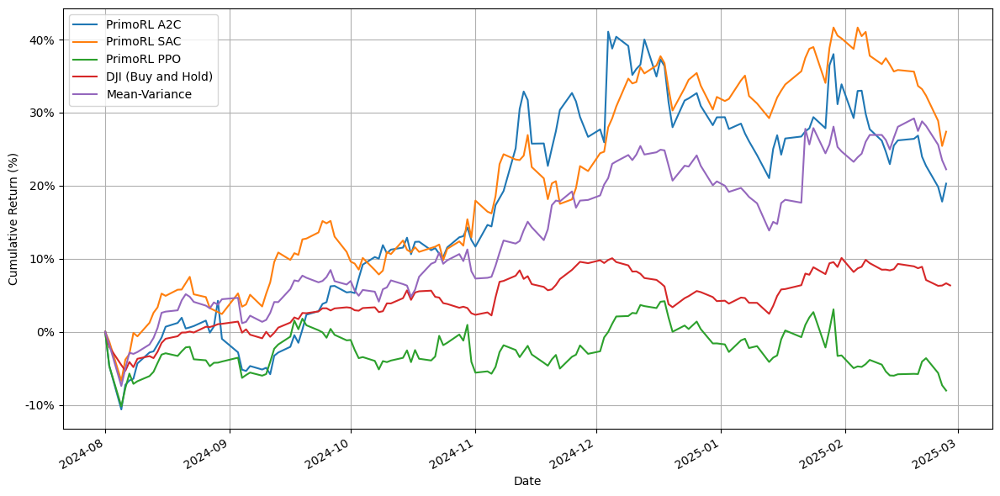
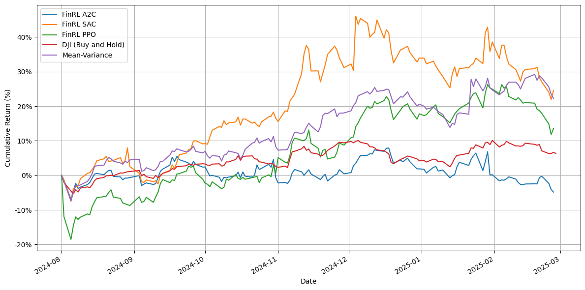

# PrimoGPT: Finance Reinforcement Learning and Natural Language Processing

## Overview

PrimoGPT is a modular trading system developed as part of doctoral research titled "An Automated Stock Market Trading System Based on Deep Reinforcement Learning". The system combines Natural Language Processing (NLP) and Deep Reinforcement Learning (DRL) to support investment decisions, aiming to minimize risk and potential losses through deep financial market analysis.

The research introduces two key components: PrimoGPT, a specialized model for generating NLP features from financial texts (news, reports, etc.), and PrimoRL, a deep reinforcement learning model for making trading decisions. The system has demonstrated significant performance in real-world testing, achieving notable returns on major technology stocks (41.19% on NFLX, 24.24% on AAPL, and 26.72% on AMZN) while maintaining high Sharpe ratios.

## Research and Educational Purpose

This project was created primarily for research and educational purposes as part of doctoral studies. It is not designed as a ready-to-use application at this stage. The codebase is structured to demonstrate concepts and methodologies rather than provide a turnkey trading solution. Users should be aware that:

- The system requires technical knowledge to set up and run
- Components are organized for research exploration rather than end-user experience

Future iterations will focus on improving usability and creating more accessible interfaces as outlined in the development roadmap.

## Innovation and Future Directions

The core innovation of this project lies in its RAG (Retrieval Augmented Generation) system for feature generation from financial texts. This approach enables:

- **Contextual decision making**: By extracting structured features from unstructured financial news and reports, the system provides critical context for trading decisions
- **Flexible feature generation**: The generated features can be utilized for various downstream tasks beyond trading, including risk assessment, portfolio optimization, and market analysis
- **Early AI agent approach**: This prototype was developed in early 2024, before AI agent systems became popular, showing an early application of LLMs to financial analysis

### Future Development Roadmap

The next iteration of the system will focus on:
- **Sentence embedding integration (some kind)**: Moving beyond predefined feature categories to a more flexible way of representing financial text
- **Autonomous feature generation**: Allowing LLMs to create relevant features on their own based on all available inputs without predefined structures
- **Component separation**: Separating PrimoGPT and PrimoRL into standalone libraries that can be developed and used independently
- **Library development**: Converting the codebase into easy-to-use libraries that other developers can integrate into their projects
- **User interface**: Creating a simple Streamlit-based UI that allows anyone to test and use the system without coding knowledge
- **Primo Investing platform**: Using these libraries as the core of a new Primo Investing platform that will be publicly available

This evolution will make the system more adaptable and better at finding important patterns in financial data that traditional methods might miss.

## Project Architecture

The project consists of two main components:

### 1. PrimoGPT Module
- Custom implementation of RAG (Retrieval Augmented Generation)
- Feature generation pipeline for financial data processing
- Fine-tuned LLM model based on Meta-Llama-3.1-8B-Instruct
- Key components:
  - `prepare_data.py`: Data collection and preprocessing pipeline (base on FinGPT Forecaster idea)
  - `create_prompt.py`: Custom prompt engineering system (base on FinGPT Forecaster idea)

### 2. PrimoRL Module
Three custom trading environments extending FinRL:
- `env_primo_default`: Enhanced stock trading environment with custom logging (extended from FinRL)
- `env_primo_default_nlp`: Extended environment with NLP capabilities (extended from FinRL)
- `env_primorl`: New environment incorporating NLP features with custom reward function (extended from FinRL)

## Project Structure

The project is organized into notebooks for experimentation and source code for the core implementation:

```
notebooks/
├── 1. Get and process data/                 # Data collection and preprocessing scripts
├── 2. Train PrimoGPT model/                 # PrimoGPT model fine-tuning
├── 3. Trading benchmark strategy/           # Implementation of baseline trading strategies
├── 4. FinRL benchmark strategy/             # Implementation of FinRL trading strategies
├── 5. Generate NLP features with PrimoGPT/  # NLP feature extraction pipeline
└── 6. PrimoRL trading with NLP features/    # Combined NLP-RL trading experiments
src/
├── primogpt/                                # Core PrimoGPT implementation
└── primorl/                                 # Core PrimoRL trading environments
```

Each notebook directory contains specific experiments and implementations:
- **Get and process data**: Scripts for collecting financial data, preprocessing, and feature engineering
- **Train PrimoGPT model**: Notebooks for training and fine-tuning the LLM model for financial text analysis
- **Trading benchmark strategy**: Implementation and evaluation of traditional trading strategies as benchmarks
- **FinRL benchmark strategy**: Implementation of FinRL trading strategies
- **Generate NLP features**: Pipeline for extracting NLP features from financial texts using PrimoGPT
- **PrimoRL trading with NLP**: Integration of NLP features into RL trading strategies with performance analysis

## Research Validation

The system has been validated through extensive testing on multiple stocks (AAPL, NFLX, MSFT, CRM, AMZN) with:
- Training period: 2021-09-01 to 2023-12-31
- Testing period: 2024-01-01 to 2024-07-31

## Results Comparison

The following table presents the key performance metrics for all tested strategies:

| Models          | Cumulative Return | Sharpe Ratio | Annual Volatility | Maximum Drawdown |
|----------------|------------------|--------------|------------------|-----------------|
| Mean-Variance  | 16.66%          | 1.55         | 18.48%          | -8.52%         |
| DJI (B&H)      | 8.02%           | 1.40         | 10.00%          | -5.20%         |
| FinRL (A2C)    | 17.84%          | 1.30         | 24.18%          | -15.33%        |
| FinRL (SAC)    | 25.53%          | 1.74         | 24.54%          | -10.49%        |
| FinRL (PPO)    | 16.34%          | 1.36         | 21.03%          | -10.50%        |
| PrimoRL (A2C)  | 14.68%          | 1.31         | 19.75%          | -10.50%        |
| PrimoRL (SAC)  | 22.19%          | 1.53         | 24.83%          | -10.07%        |
| PrimoRL (PPO)  | **32.29%**      | **2.19**     | 23.60%          | **-7.47%**     |

The following graphs demonstrate the performance comparison between PrimoRL and FinRL implementations using different reinforcement learning algorithms (A2C, SAC, PPO) against traditional strategies (DJI Buy and Hold, Mean-Variance):

### PrimoRL Performance


PrimoRL shows consistently better performance across all RL algorithms, with PPO achieving the highest returns (>40% at peak). The system maintains superior performance compared to traditional strategies throughout the testing period.

### FinRL Benchmark


The baseline FinRL implementation, while still outperforming traditional strategies, shows lower overall returns and higher volatility compared to PrimoRL, particularly visible in the A2C implementation's performance.

The comparison highlights PrimoRL's enhanced stability and improved returns, demonstrating the effectiveness of incorporating NLP features and custom reward functions in the trading environment.

## Acknowledgments

This research builds upon and extends the excellent work of the AI4Finance Foundation. Their open-source projects served as the foundation and primary inspiration for this research. Special thanks for their groundbreaking work on:
- [FinRL](https://github.com/AI4Finance-Foundation/FinRL) - The base framework for our reinforcement learning implementation
- [FinGPT](https://github.com/AI4Finance-Foundation/FinGPT) - Inspiration for financial NLP components

The success of this research would not have been possible without these foundational contributions to the field of AI in finance.

## Future Development

This repository will undergo further enhancements following the doctoral defense, including:
- Code optimization and performance improvements
- Translation of remaining components to English
- Detailed setup and execution documentation
- Enhanced RAG system implementation
- Extended documentation

## License and Disclaimer

This project is licensed under the MIT License. This repository contains academic research code intended for educational purposes only. Nothing herein constitutes financial advice or trading recommendations. The trading strategies and analyses are experimental in nature and have not been validated for real-world trading. Users should be aware that trading involves substantial risk of loss and should always consult financial professionals before making investment decisions.

---
Note: This repository is part of ongoing doctoral research. Further improvements and documentation will be added following the defense.