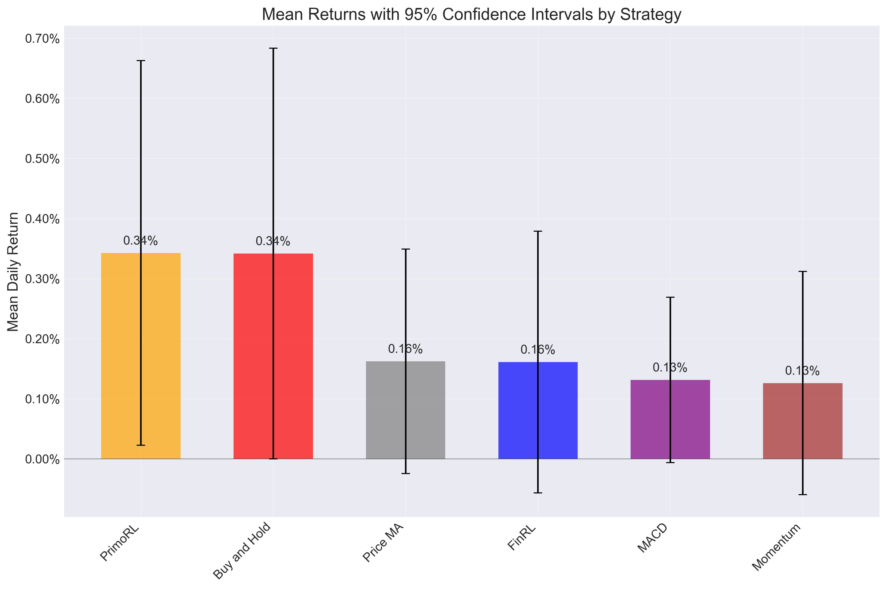

# Statistical Analysis of Trading Strategies

## ANOVA Test Results

One-way ANOVA test was performed to determine if there are statistically significant differences between strategy returns.

**ANOVA p-value:** 0.625545

The ANOVA test does not provide sufficient evidence of statistically significant differences between the performance of different strategies (p >= 0.05).

### ANOVA Table

```
               sum_sq     df        F    PR(>F)
C(strategy)  0.000752    5.0  0.69735  0.625545
Residual     0.183419  850.0      NaN       NaN
```

## Strategy Performance Summary

| Strategy     | Mean Return (%)   | Std Dev (%)   | CI Range (%)        |   Sample Size |
|:-------------|:------------------|:--------------|:--------------------|--------------:|
| PrimoRL      | 0.3425%           | 1.9227%       | [0.0224%, 0.6626%]  |           142 |
| Buy and Hold | 0.3414%           | 2.0602%       | [-0.0003%, 0.6832%] |           143 |
| Price MA     | 0.1622%           | 1.1258%       | [-0.0245%, 0.3490%] |           143 |
| FinRL        | 0.1610%           | 1.3085%       | [-0.0569%, 0.3788%] |           142 |
| MACD         | 0.1314%           | 0.8298%       | [-0.0063%, 0.2690%] |           143 |
| Momentum     | 0.1260%           | 1.1201%       | [-0.0599%, 0.3118%] |           143 |

## Confidence Intervals



## Pairwise Comparisons with PrimoRL

| PrimoRL vs   |   Mean Difference | % Difference   |   t-statistic |   p-value | PrimoRL Better?   | Statistically Significant?   |
|:-------------|------------------:|:---------------|--------------:|----------:|:------------------|:-----------------------------|
| FinRL        |       0.00181497  | 112.75%        |      0.92666  |  0.355002 | Yes               | No                           |
| Buy and Hold |       1.03254e-05 | 0.30%          |      0.004359 |  0.996525 | Yes               | No                           |
| MACD         |       0.00211112  | 160.71%        |      1.19773  |  0.232503 | Yes               | No                           |
| Momentum     |       0.00216512  | 171.89%        |      1.15642  |  0.248726 | Yes               | No                           |
| Price MA     |       0.00180238  | 111.10%        |      0.961429 |  0.337359 | Yes               | No                           |

## Statistical Significance Summary

PrimoRL outperforms 5 out of 5 other strategies

PrimoRL significantly outperforms 0 out of 5 other strategies (p < 0.05)
