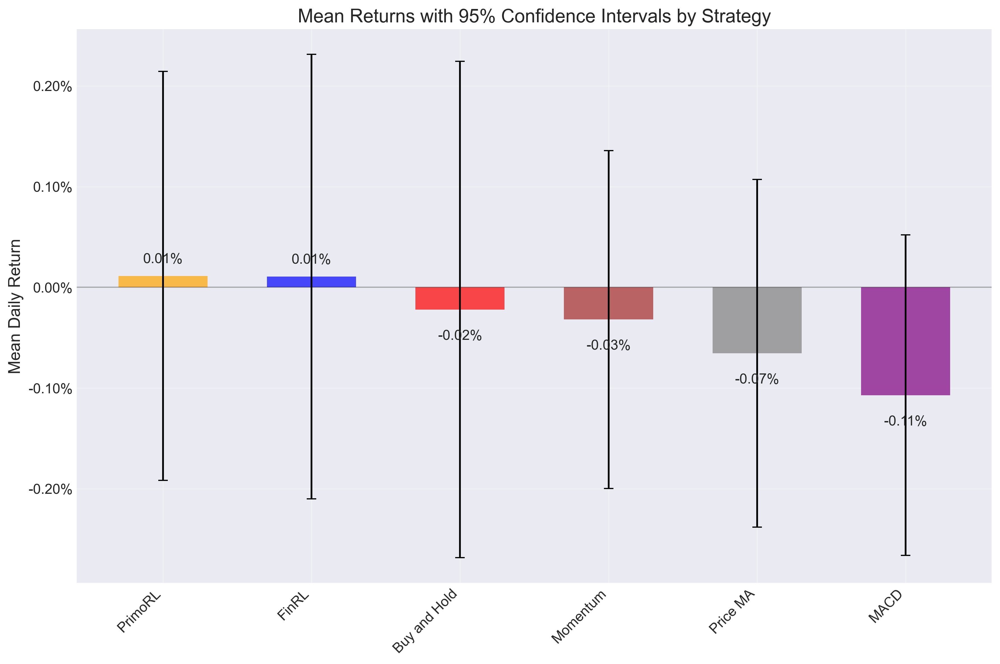

# Statistical Analysis of Trading Strategies

## ANOVA Test Results

One-way ANOVA test was performed to determine if there are statistically significant differences between strategy returns.

**ANOVA p-value:** 0.957903

The ANOVA test does not provide sufficient evidence of statistically significant differences between the performance of different strategies (p >= 0.05).

### ANOVA Table

```
               sum_sq     df         F    PR(>F)
C(strategy)  0.000150    5.0  0.211007  0.957903
Residual     0.120836  850.0       NaN       NaN
```

## Strategy Performance Summary

| Strategy     | Mean Return (%)   | Std Dev (%)   | CI Range (%)        |   Sample Size |
|:-------------|:------------------|:--------------|:--------------------|--------------:|
| PrimoRL      | 0.0113%           | 1.2195%       | [-0.1917%, 0.2143%] |           142 |
| FinRL        | 0.0106%           | 1.3253%       | [-0.2100%, 0.2313%] |           142 |
| Buy and Hold | -0.0220%          | 1.4855%       | [-0.2685%, 0.2244%] |           143 |
| Momentum     | -0.0319%          | 1.0112%       | [-0.1996%, 0.1359%] |           143 |
| Price MA     | -0.0655%          | 1.0400%       | [-0.2380%, 0.1070%] |           143 |
| MACD         | -0.1070%          | 0.9585%       | [-0.2660%, 0.0520%] |           143 |

## Confidence Intervals



## Pairwise Comparisons with PrimoRL

| PrimoRL vs   |   Mean Difference | % Difference   |   t-statistic |   p-value | PrimoRL Better?   | Statistically Significant?   |
|:-------------|------------------:|:---------------|--------------:|----------:|:------------------|:-----------------------------|
| FinRL        |       6.73186e-06 | 6.33%          |    0.00443852 |  0.996462 | Yes               | No                           |
| Buy and Hold |       0.000333407 | 151.30%        |    0.206427   |  0.836611 | Yes               | No                           |
| MACD         |       0.00118338  | 110.56%        |    0.907168   |  0.365136 | Yes               | No                           |
| Momentum     |       0.000431864 | 135.45%        |    0.32417    |  0.746057 | Yes               | No                           |
| Price MA     |       0.000767833 | 117.26%        |    0.569727   |  0.569327 | Yes               | No                           |

## Statistical Significance Summary

PrimoRL outperforms 5 out of 5 other strategies

PrimoRL significantly outperforms 0 out of 5 other strategies (p < 0.05)
