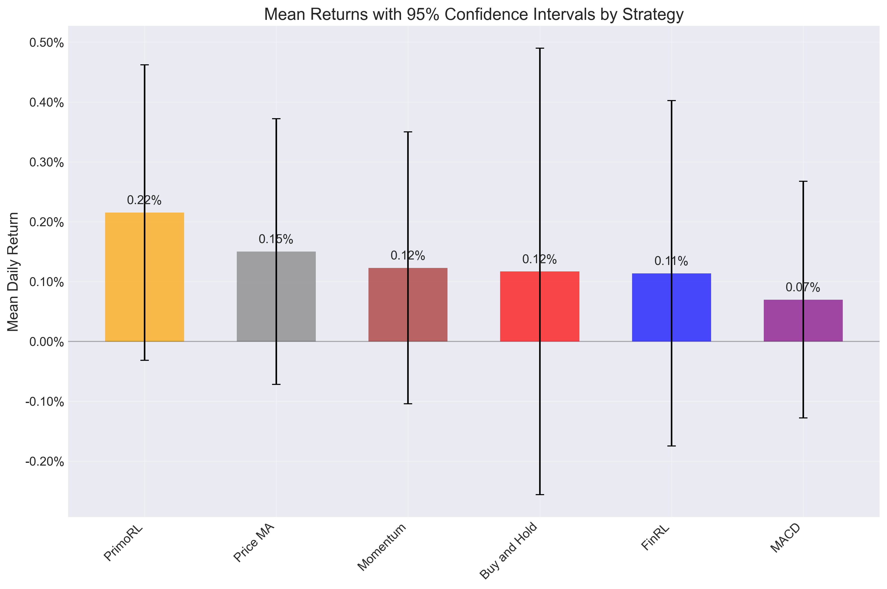

# Statistical Analysis of Trading Strategies

## ANOVA Test Results

One-way ANOVA test was performed to determine if there are statistically significant differences between strategy returns.

**ANOVA p-value:** 0.985428

The ANOVA test does not provide sufficient evidence of statistically significant differences between the performance of different strategies (p >= 0.05).

### ANOVA Table

```
               sum_sq     df       F    PR(>F)
C(strategy)  0.000168    5.0  0.1305  0.985428
Residual     0.218717  850.0     NaN       NaN
```

## Strategy Performance Summary

| Strategy     | Mean Return (%)   | Std Dev (%)   | CI Range (%)        |   Sample Size |
|:-------------|:------------------|:--------------|:--------------------|--------------:|
| PrimoRL      | 0.2154%           | 1.4824%       | [-0.0314%, 0.4622%] |           142 |
| Price MA     | 0.1501%           | 1.3371%       | [-0.0718%, 0.3719%] |           143 |
| Momentum     | 0.1229%           | 1.3684%       | [-0.1041%, 0.3500%] |           143 |
| Buy and Hold | 0.1168%           | 2.2477%       | [-0.2561%, 0.4897%] |           143 |
| FinRL        | 0.1137%           | 1.7328%       | [-0.1748%, 0.4022%] |           142 |
| MACD         | 0.0698%           | 1.1910%       | [-0.1278%, 0.2674%] |           143 |

## Confidence Intervals



## Pairwise Comparisons with PrimoRL

| PrimoRL vs   |   Mean Difference | % Difference   |   t-statistic |   p-value | PrimoRL Better?   | Statistically Significant?   |
|:-------------|------------------:|:---------------|--------------:|----------:|:------------------|:-----------------------------|
| FinRL        |       0.00101677  | 89.43%         |      0.529451 |  0.596919 | Yes               | No                           |
| Buy and Hold |       0.000985863 | 84.41%         |      0.435847 |  0.66333  | Yes               | No                           |
| MACD         |       0.00145573  | 208.55%        |      0.910287 |  0.363484 | Yes               | No                           |
| Momentum     |       0.000924351 | 75.19%         |      0.544936 |  0.58623  | Yes               | No                           |
| Price MA     |       0.000653171 | 43.53%         |      0.389118 |  0.697485 | Yes               | No                           |

## Statistical Significance Summary

PrimoRL outperforms 5 out of 5 other strategies

PrimoRL significantly outperforms 0 out of 5 other strategies (p < 0.05)
