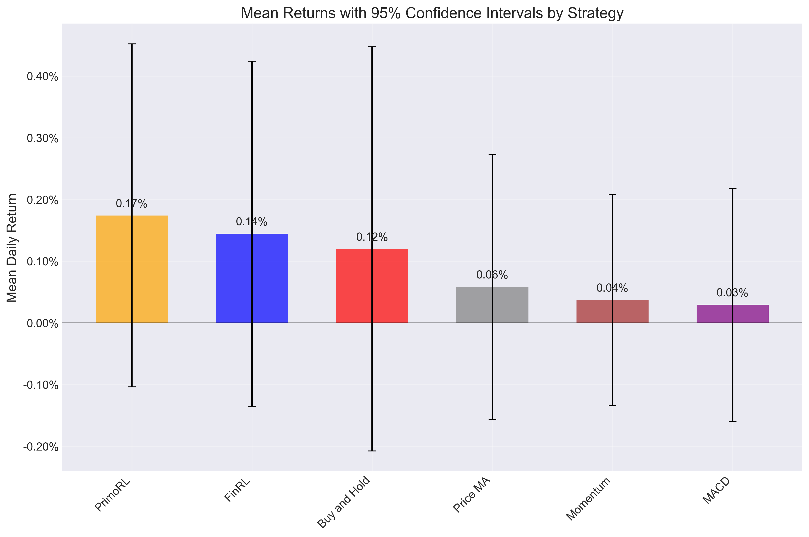

# Statistical Analysis of Trading Strategies

## ANOVA Test Results

One-way ANOVA test was performed to determine if there are statistically significant differences between strategy returns.

**ANOVA p-value:** 0.949273

The ANOVA test does not provide sufficient evidence of statistically significant differences between the performance of different strategies (p >= 0.05).

### ANOVA Table

```
               sum_sq     df         F    PR(>F)
C(strategy)  0.000262    5.0  0.230421  0.949273
Residual     0.193036  850.0       NaN       NaN
```

## Strategy Performance Summary

| Strategy     | Mean Return (%)   | Std Dev (%)   | CI Range (%)        |   Sample Size |
|:-------------|:------------------|:--------------|:--------------------|--------------:|
| PrimoRL      | 0.1742%           | 1.6691%       | [-0.1037%, 0.4521%] |           142 |
| FinRL        | 0.1448%           | 1.6787%       | [-0.1347%, 0.4242%] |           142 |
| Buy and Hold | 0.1199%           | 1.9748%       | [-0.2077%, 0.4475%] |           143 |
| Price MA     | 0.0585%           | 1.2941%       | [-0.1562%, 0.2732%] |           143 |
| Momentum     | 0.0371%           | 1.0321%       | [-0.1341%, 0.2083%] |           143 |
| MACD         | 0.0293%           | 1.1379%       | [-0.1594%, 0.2181%] |           143 |

## Confidence Intervals



## Pairwise Comparisons with PrimoRL

| PrimoRL vs   |   Mean Difference | % Difference   |   t-statistic |   p-value | PrimoRL Better?   | Statistically Significant?   |
|:-------------|------------------:|:---------------|--------------:|----------:|:------------------|:-----------------------------|
| FinRL        |       0.000294341 | 20.33%         |      0.147645 |  0.882728 | Yes               | No                           |
| Buy and Hold |       0.000542786 | 45.27%         |      0.249784 |  0.80294  | Yes               | No                           |
| MACD         |       0.00144842  | 493.61%        |      0.85238  |  0.394823 | Yes               | No                           |
| Momentum     |       0.00137125  | 370.00%        |      0.830554 |  0.40707  | Yes               | No                           |
| Price MA     |       0.00115696  | 197.81%        |      0.65134  |  0.51539  | Yes               | No                           |

## Statistical Significance Summary

PrimoRL outperforms 5 out of 5 other strategies

PrimoRL significantly outperforms 0 out of 5 other strategies (p < 0.05)
