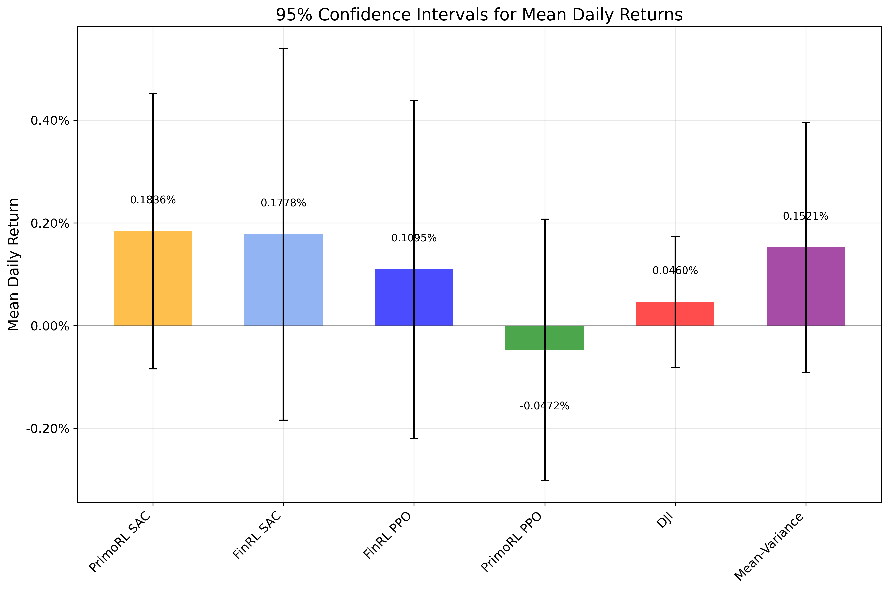
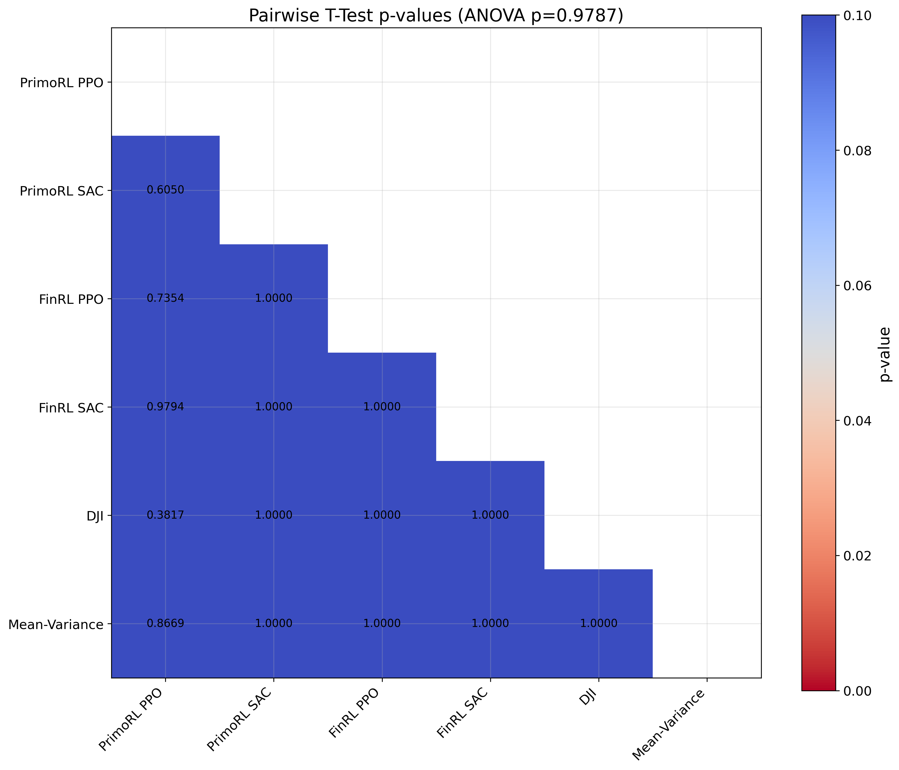

# Statistical Analysis of Portfolio Trading Strategies

## Overview of Strategies

Analysis includes 6 strategies:

### Portfolio Strategies
- PrimoRL PPO
- PrimoRL SAC
- FinRL PPO
- FinRL SAC

### Benchmark Strategies
- DJI

### Traditional Strategies
- Mean-Variance

## Strategy Performance Summary

| Strategy      | Mean Daily Return   | Daily CI Lower   | Daily CI Upper   |   Sample Size |
|:--------------|:--------------------|:-----------------|:-----------------|--------------:|
| PrimoRL PPO   | 0.1838%             | -0.0995%         | 0.4672%          |           142 |
| FinRL SAC     | 0.1778%             | -0.1844%         | 0.5400%          |           142 |
| Mean-Variance | 0.1521%             | -0.0911%         | 0.3953%          |           142 |
| FinRL PPO     | 0.1095%             | -0.2196%         | 0.4386%          |           142 |
| PrimoRL SAC   | 0.0809%             | -0.1914%         | 0.3532%          |           142 |
| DJI           | 0.0460%             | -0.0815%         | 0.1735%          |           143 |

## Confidence Intervals

## ANOVA Test Results

One-way ANOVA test was performed to determine if there are statistically significant differences between strategy returns.

**ANOVA p-value:** 0.978700

The ANOVA test does not provide sufficient evidence of statistically significant differences between the performance of different strategies (p >= 0.05).

## Pairwise Comparisons

| Reference   | Compared To   |   t-statistic |   p-value | Significant   |
|:------------|:--------------|--------------:|----------:|:--------------|
| PrimoRL PPO | PrimoRL SAC   |        0.5178 |    0.605  | False         |
| PrimoRL PPO | FinRL PPO     |        0.3383 |    0.7354 | False         |
| PrimoRL PPO | FinRL SAC     |        0.0259 |    0.9794 | False         |
| PrimoRL PPO | DJI           |        0.8767 |    0.3817 | False         |
| PrimoRL PPO | Mean-Variance |        0.1678 |    0.8669 | False         |

## Statistical Significance Heatmap

## Summary of PrimoRL Performance

No statistically significant difference between PrimoRL and 5 strategies (p >= 0.05):
- PrimoRL SAC (p=0.6050)
- FinRL PPO (p=0.7354)
- FinRL SAC (p=0.9794)
- DJI (p=0.3817)
- Mean-Variance (p=0.8669)
